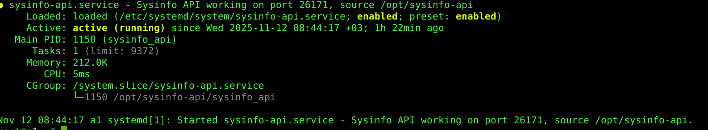
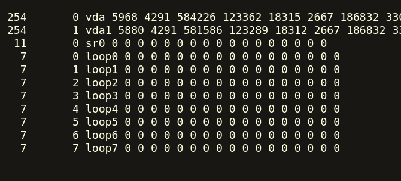

# Linux System Information API

[](https://www.gnu.org/licenses/gpl-3.0)

This project is designed to operate as a service on Linux systems and retrieve system information through various endpoints from a specific port.



## Using 

### Requirements

 - gcc
 - make
 - systemd

### Execute and Install

```

make
make install

## or just work

make
./sysinfo_api


## easy install
wget https://raw.githubusercontent.com/QueryVS/sysinfo-api/refs/heads/main/scripts/install-all-server.sh
./install-all-server.sh prod
```

### Working Port

 - default port :: 26171
 - address : http://ip_address:26171/
   - endpoints : http://ip_address:26171/cpuinfo
   - endpoints : http://ip_address:26171/meminfo
   - endpoints : http://ip_address:26171/diskinfo


## HTTP Response




---